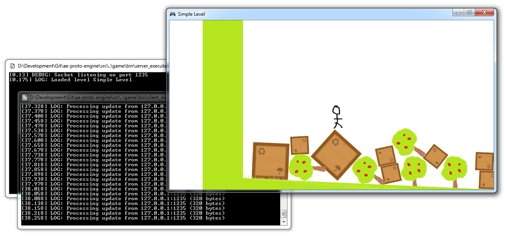

ae-proto-engine
===============

Little prototype networked game engine written in C++. Features a client/server networked architecture, physics simulation with Box2D, and renderer written with SFML.

Requirements
---------------
* Visual Studio 2013 (solutions included, more platforms in the future)
